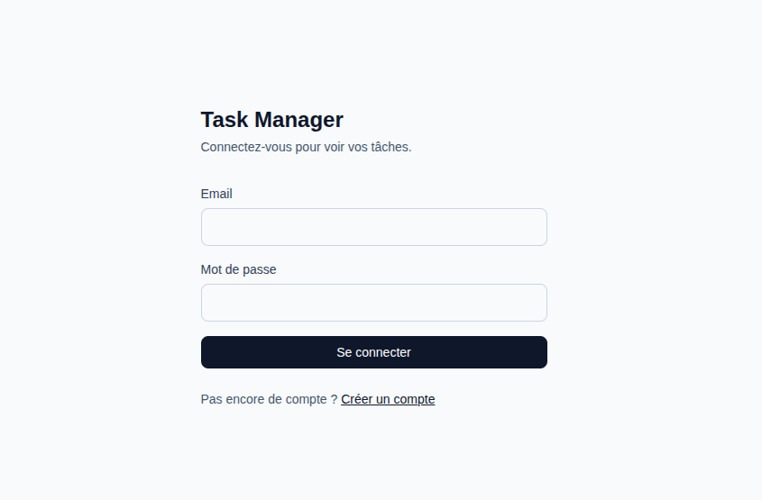
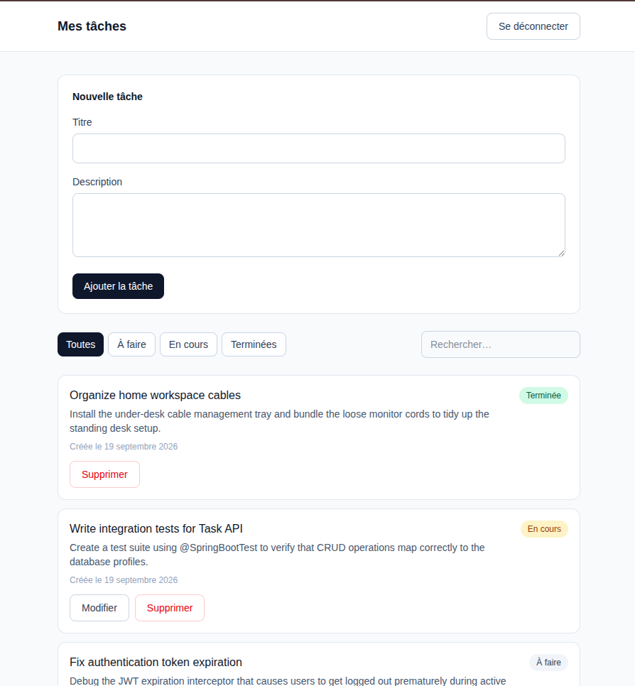

# Task Manager


Application de gestion de tâches avec authentification, développée dans le cadre d'un test technique.

Chaque utilisateur dispose d'un espace privé : il crée un compte, se connecte, et gère ses propres tâches. Les données sont strictement cloisonnées entre utilisateurs.

**Stack :** Java 21 · Spring Boot 4.1 · Spring Data JPA · Spring Security (JWT) · MySQL 8.4 · React 19 · Vite · TypeScript · Tailwind CSS 4 · Docker

---

## Sommaire

- [Fonctionnalités](#fonctionnalités)
- [Démarrage rapide (Docker)](#démarrage-rapide-docker)
- [Démarrage en mode développement](#démarrage-en-mode-développement)
- [Variables d'environnement](#variables-denvironnement)
- [Architecture](#architecture)
- [API](#api)
- [Choix techniques](#choix-techniques)
- [Sécurité](#sécurité)
- [Captures d'écran](#captures-décran)
- [Limites connues et pistes d'amélioration](#limites-connues-et-pistes-damélioration)

---

## Fonctionnalités

- Inscription et connexion par email / mot de passe, avec token JWT
- Création, consultation, modification et suppression de tâches
- Filtrage par statut (à faire, en cours, terminée)
- Recherche plein texte sur le titre et la description, insensible à la casse et aux accents
- Cloisonnement strict des données entre utilisateurs
- Gestion des erreurs API avec messages par champ dans les formulaires
- Interface responsive

---

## Démarrage rapide (Docker)

**Prérequis :** Docker et Docker Compose v2. Rien d'autre à installer.

```bash
git clone git@github.com:salamsahane/cova_task_manager.git
cd cova_task_manager

cp .env.example .env
# Renseignez des valeurs dans .env (voir la section Variables d'environnement)

docker compose up --build
```

Le premier démarrage prend quelques minutes (compilation du backend, build du frontend).

| Service | URL |
|---|---|
| Application web | http://localhost:5173 |
| API | http://localhost:8080 |
| MySQL | localhost:3306 |

**Générer un secret JWT :**

```bash
openssl rand -base64 48
```

**Arrêter :**

```bash
docker compose down      # conserve les données
docker compose down -v   # supprime aussi la base
```

---

## Démarrage en mode développement

### 1. Base de données

```bash
cp .env.example .env     # puis renseignez les valeurs
docker compose up -d mysql
```

### 2. Backend

**Prérequis :** JDK 21. Maven n'est pas nécessaire, le wrapper s'en charge.

```bash
cd backend
./mvnw spring-boot:run
```

L'API démarre sur http://localhost:8080.

### 3. Frontend

**Prérequis :** Node.js 20 ou supérieur.

```bash
cd frontend
cp .env.example .env
npm install
npm run dev
```

L'application démarre sur http://localhost:5173.

---

## Variables d'environnement

### Racine — `.env`

| Variable | Description | Exemple |
|---|---|---|
| `MYSQL_DATABASE` | Nom de la base | `taskmanager` |
| `MYSQL_USER` | Utilisateur applicatif | `taskmanager` |
| `MYSQL_PASSWORD` | Mot de passe applicatif | — |
| `MYSQL_ROOT_PASSWORD` | Mot de passe root MySQL | — |
| `DB_HOST` | Hôte de la base (en dev local) | `localhost` |
| `DB_PORT` | Port MySQL | `3306` |
| `JWT_SECRET` | Secret de signature, **256 bits minimum** | `openssl rand -base64 48` |
| `JWT_EXPIRATION_MS` | Durée de vie du token | `7200000` (2 h) |
| `APP_CORS_ALLOWED_ORIGINS` | Origines autorisées, séparées par des virgules | `http://localhost:5173` |
| `VITE_API_URL` | URL de l'API pour le build frontend | `http://localhost:8080` |

### Frontend — `frontend/.env`

| Variable | Description |
|---|---|
| `VITE_API_URL` | URL de l'API |

> Les fichiers `.env` ne sont pas versionnés. Les `.env.example` listent les variables attendues avec des valeurs factices.

---

## Architecture

```
cova_task_manager/
├── backend/                Spring Boot — API REST
│   ├── src/main/java/com/salamsahane/taskmanager/
│   │   ├── auth/           Authentification : JWT, filtre, endpoints
│   │   ├── task/           Domaine métier : entité, service, controller, DTOs
│   │   ├── user/           Entité utilisateur et repository
│   │   └── common/         Configuration de sécurité, gestion globale des erreurs
│   └── Dockerfile          Build multi-stage (Maven → JRE Alpine)
│
├── frontend/               React + Vite + TypeScript
│   ├── src/
│   │   ├── api/            Client HTTP centralisé et appels typés
│   │   ├── auth/           Contexte d'authentification, routes protégées
│   │   ├── components/     Composants réutilisables
│   │   ├── pages/          Connexion, inscription, tâches
│   │   └── types/          Types miroirs des DTOs backend
│   ├── nginx.conf          Configuration de service des fichiers statiques
│   └── Dockerfile          Build multi-stage (Node → nginx Alpine)
│
├── docker-compose.yml      Orchestration des trois services
└── .env.example
```

### Organisation du backend

Les packages sont organisés **par fonctionnalité** (`task/`, `auth/`, `user/`) plutôt que par couche technique. Tout ce qui concerne un domaine est regroupé, ce qui facilite la navigation et, le cas échéant, l'extraction d'un domaine en service autonome.

Chaque fonctionnalité suit la même structure en trois couches :

| Couche | Responsabilité |
|---|---|
| **Controller** | Traduction HTTP, déclenchement de la validation, choix du code de réponse. Aucune logique métier |
| **Service** | Logique métier, transactions, conversion entité ↔ DTO |
| **Repository** | Accès aux données via Spring Data JPA |

### Modèle de données

```
users                          tasks
├── id          BIGINT PK      ├── id          BIGINT PK
├── email       VARCHAR(255) U ├── title       VARCHAR(200)
├── password    VARCHAR(60)    ├── description VARCHAR(2000) NULL
└── created_at  DATETIME(6)    ├── status      ENUM
                               ├── created_at  DATETIME(6)
                               ├── updated_at  DATETIME(6)
                               └── user_id     BIGINT FK → users.id
```

Un index est défini sur `tasks.user_id`, colonne présente dans toutes les requêtes de lecture.

---

## API

Base : `http://localhost:8080`

### Authentification

| Méthode | Endpoint | Corps | Réponse |
|---|---|---|---|
| `POST` | `/api/auth/register` | `{ email, password }` | `201` · `{ token }` |
| `POST` | `/api/auth/login` | `{ email, password }` | `200` · `{ token }` |

### Tâches

Toutes ces routes exigent l'en-tête `Authorization: Bearer <token>`.

| Méthode | Endpoint | Description | Réponse |
|---|---|---|---|
| `GET` | `/api/tasks` | Liste des tâches de l'utilisateur | `200` |
| `GET` | `/api/tasks?status=OPEN&q=texte` | Liste filtrée | `200` |
| `GET` | `/api/tasks/{id}` | Détail d'une tâche | `200` |
| `POST` | `/api/tasks` | Création · `{ title, description? }` | `201` + en-tête `Location` |
| `PUT` | `/api/tasks/{id}` | Remplacement · `{ title, description?, status }` | `200` |
| `DELETE` | `/api/tasks/{id}` | Suppression | `204` |

Statuts possibles : `OPEN`, `IN_PROGRESS`, `DONE`.

### Codes d'erreur

| Code | Signification |
|---|---|
| `400` | Validation échouée, corps illisible, ou paramètre invalide |
| `401` | Token absent, invalide ou expiré · identifiants incorrects |
| `404` | Ressource inexistante **ou appartenant à un autre utilisateur** |
| `409` | Email déjà utilisé |

Les erreurs suivent le format standard **RFC 9457** (`application/problem+json`) :

```json
{
  "title": "Bad Request",
  "status": 400,
  "detail": "Validation failed",
  "instance": "/api/tasks",
  "errors": { "title": "must not be blank" }
}
```

Le champ `errors` permet au frontend d'afficher chaque message sous le champ concerné.

---

## Choix techniques

### Authentification stateless par JWT

Le serveur ne conserve aucune session : chaque requête porte son token, validé par signature. L'API peut donc être répliquée horizontalement sans session partagée ni affinité de session, ce qui convient à un déploiement conteneurisé.

Le compromis assumé est l'impossibilité de révoquer un token avant son expiration. La durée de vie est limitée à deux heures ; une évolution naturelle serait un couple *access token* court et *refresh token*.

### Stockage du token côté client

Le token est conservé dans `localStorage`. Ce choix expose au XSS mais immunise contre le CSRF, puisque le navigateur n'envoie jamais l'en-tête `Authorization` de lui-même, raison pour laquelle la protection CSRF est désactivée côté serveur.

### Hachage des mots de passe

BCrypt avec un facteur de coût de 10. Le sel est généré automatiquement et intégré au hachage produit, ce qui garantit que deux mots de passe identiques produisent des empreintes différentes.

### DTOs plutôt qu'exposition des entités

Les entités ne traversent jamais la frontière HTTP. En entrée, cela ferme la voie au *mass assignment* : un client ne peut imposer ni l'identifiant, ni les horodatages, ni surtout le propriétaire d'une tâche. En sortie, cela évite toute fuite de champ sensible et découple le contrat de l'API du schéma de base.

La validation des DTOs est calée sur les contraintes de la base, de sorte qu'une donnée invalide produise un `400` explicite plutôt qu'un `500` issu du rejet par MySQL.

### Filtrage et recherche côté serveur

Le filtrage par statut et la recherche sont traités dans une requête JPQL unique, où chaque critère est neutralisé lorsqu'il vaut `null`. Cette approche reste valable quand le volume de données augmente, contrairement à un filtrage côté client qui imposerait de tout transférer.

La collation MySQL `utf8mb4_0900_ai_ci` rend la recherche insensible à la casse et aux accents sans traitement supplémentaire.

### Réponses `404` sur les ressources d'autrui

Une tentative d'accès à la tâche d'un autre utilisateur renvoie `404` et non `403`. Un `403` confirmerait l'existence de la ressource ; le `404` ne divulgue rien.

Le même raisonnement s'applique à la connexion, où un email inconnu et un mot de passe erroné produisent un message identique, afin d'empêcher l'énumération des comptes inscrits.

### Images Docker en multi-stage

Les outils de compilation (Maven, JDK, Node) restent dans l'étape de build et n'apparaissent pas dans l'image finale, qui ne contient qu'un JRE ou nginx. Les images sont plus légères, démarrent plus vite et présentent une surface d'attaque réduite.

Le conteneur backend s'exécute sous un utilisateur non privilégié plutôt qu'en root.

### Portée du modèle `User`

Le sujet ne spécifiait pas les champs de l'utilisateur. Le modèle se limite donc à ce que requiert l'authentification : email et mot de passe. Ajouter un profil sans usage applicatif aurait produit du code inutilisé.

### Comportement des tâches terminées

Une tâche au statut `DONE` n'est plus modifiable depuis l'interface, mais reste supprimable. Cette restriction est purement ergonomique : l'API continue d'accepter les deux opérations.

---

## Sécurité

| Mesure | Mise en œuvre |
|---|---|
| Mots de passe | BCrypt, sel automatique, jamais stockés en clair |
| Authentification | JWT signé, vérification de signature et d'expiration à chaque requête |
| Autorisation | Toute lecture, modification et suppression filtre sur le propriétaire dans la requête SQL |
| Injection SQL | Requêtes préparées générées par Hibernate |
| Mass assignment | DTOs dédiés en entrée |
| CORS | Origines autorisées listées explicitement, configurables par variable d'environnement |
| Secrets | Hors du code, injectés par variables d'environnement, `.env` non versionné |
| Divulgation | Messages d'erreur génériques, sans exposition de la structure interne |
| Conteneurs | Exécution sous utilisateur non privilégié |

### Point d'attention sur le contrôle d'accès

Le cloisonnement des données ne repose pas sur une vérification ajoutée à chaque endpoint, mais sur un **point de passage unique** dans le service :

```java
private Task getTaskOrThrow(Long id, User owner) {
    return taskRepository.findByIdAndOwner(id, owner)
            .orElseThrow(() -> new TaskNotFoundException(id));
}
```

Consultation, modification et suppression passent toutes par cette méthode. Il n'est donc pas possible d'omettre le contrôle sur un endpoint particulier.

Le garde de route côté React est une commodité d'interface et non une mesure de sécurité : la protection réelle est la validation du token côté serveur.

---

## Captures d'écran

| Connexion | Liste des tâches |
|---|---|
|  |  |

---

## Limites connues et pistes d'amélioration

**Schéma de base.** Hibernate génère le schéma via `ddl-auto: update`, adapté au développement mais pas à la production : les modifications de colonnes existantes ne sont pas appliquées et aucun historique n'est conservé. Une migration vers Flyway constituerait la première évolution.

**Pagination.** `GET /api/tasks` renvoie l'intégralité des tâches. Une pagination serait nécessaire au-delà de quelques centaines d'éléments.

**Recherche.** Le `LIKE '%terme%'` ne peut exploiter d'index. Sur un volume important, un index FULLTEXT ou un moteur de recherche dédié serait requis.

**Révocation des tokens.** Un token reste valide jusqu'à son expiration. Un mécanisme de *refresh token* permettrait de réduire la fenêtre d'exposition.

**Tests.** La couverture est partielle et se concentre sur les cas critiques, notamment l'isolation des données entre utilisateurs.

**Configuration du frontend.** Vite fige les variables `VITE_*` au moment du build : une même image ne peut être déployée telle quelle sur plusieurs environnements. Un fichier de configuration chargé au démarrage de l'application lèverait cette contrainte.

**Application mobile.** La partie Flutter, optionnelle, n'a pas été réalisée. L'API étant commune, elle consommerait les mêmes endpoints avec le même mécanisme d'authentification.

**Confirmations.** Les suppressions utilisent `window.confirm`. Une modale accessible serait préférable.